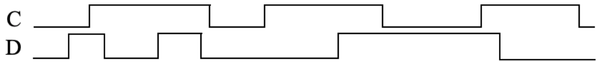
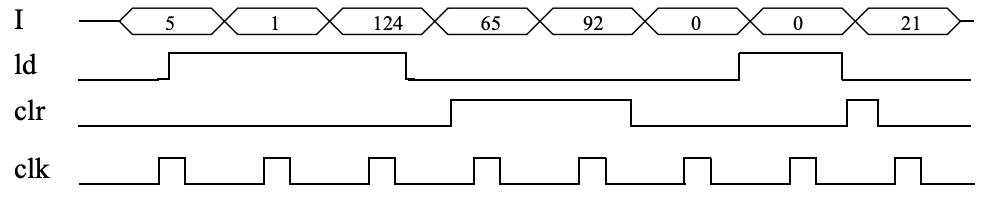

Embed math equations into Github Markdown file using a [web service](https://www.codecogs.com/latex/eqneditor.php)

# (5 pts)
Compare the behavior of D latch and D flip-flop devices by completing the timing diagram in Figure below. Provide a brief explanation of the behavior of each device. Assume each device initially stores a 0.

# (5 pts)
A circuit has an input X that is connected to the input of a D flip-flop. Using additional D flip-flops, complete the circuit so that an output Y equals the output of X’s flip-flop but delayed by two clock cycles. 

# (5 pts)
Implement the previous design in Verilog. Verify the design with a testbench with a sequence of input D.

# (5 pts)
Draw a state diagram for an FSM with no inputs and three outputs x, y, and z. xyzshould always exhibit the following sequence: 000, 001, 010, 100, repeat. The output should change only on a rising clock edge. Make 000 the initial state.

# (5 pts)
Using the process for designing a controller, convert the FSM you created for the previous problem to a controller, implementing the controller using a state register and logic gates.

# (5 pts)
Trace the behavior of an 8-bit parallel load register with 8-bit input I, 8-bit output Q, load control input ld, and synchronous clear input clr by completing the timing diagram in Figure below.

# (5 pts)
Draw the gate level design of a 1-bit full adder. Draw the schematic of a 8-bit carry-ripple adder using eight 1-bit full adders. Assuming AND gates have a delay of 2 ns, OR gates have a delay of 1 ns, and XOR gates have a delay of 3 ns, compute the longest time required to add two numbers using an 8-bit carry-ripple adder.

# (5 pts) 
Use magnitude comparators and logic to design a circuit that computes the minimum of three 8-bit numbers.

# (5 pts)
In a mirror universe, you are asked to design a comparator for three-bit 2’s complement numbers. A[0:2] and B[0:2] are both 2’s complement numbers with A2 and B2 being the MSBs. If A > B then LT should be 1 and the other outputs 0. If A < B then GT should be 1 and every other output 0. If A=B then EQ should be 1 and every other output 0.  

- a.	List the following 3-bit 2’s complement numbers in order from smallest to largest: 111, 101, 011, 010, 100.
- b.	Write the logic equations for LT, EQ and GT. Be sure to circle your final answer. Be sure you have also circled any intermediate values (nodes) you are using in your final answer.

